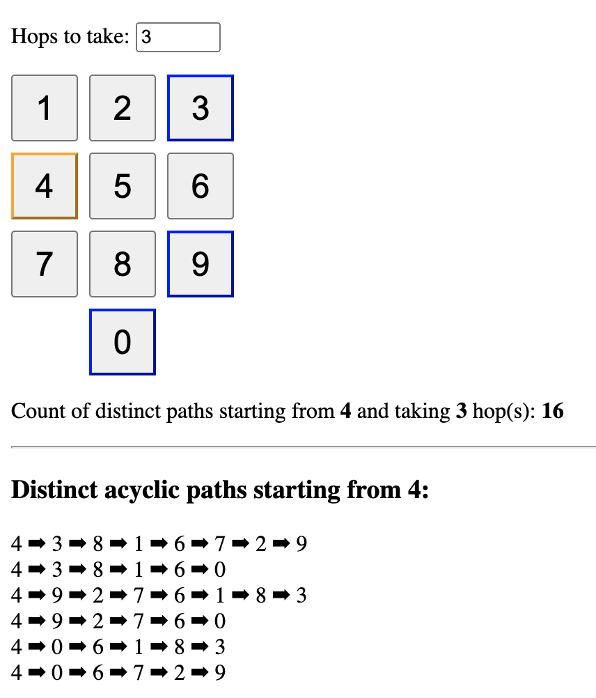

# Solid Knight's Dialer
My implementation of Knight's Dialer App. From [Kyle Simpsons's](https://github.com/getify) workshop on [Thinking in Algorithms](https://frontendmasters.com/workshops/thinking-algorithms/).

This implementation is using [SolidJS](https://www.solidjs.com/).
## Example
Hover over the buttons to see the possible moves.

Click on the buttons to see:
 - The number of distinct paths based on the "Hops to take" input.
 - The number of acrylic moves that can be made from the clicked position.


## Installation
```bash
npm install
```
## Usage
```bash
npm run dev
```
## Build
```bash
npm run build
```
This will create a `dist` folder with the build files. You can then serve the files with any static server.
## License
MIT (See LICENSE file)